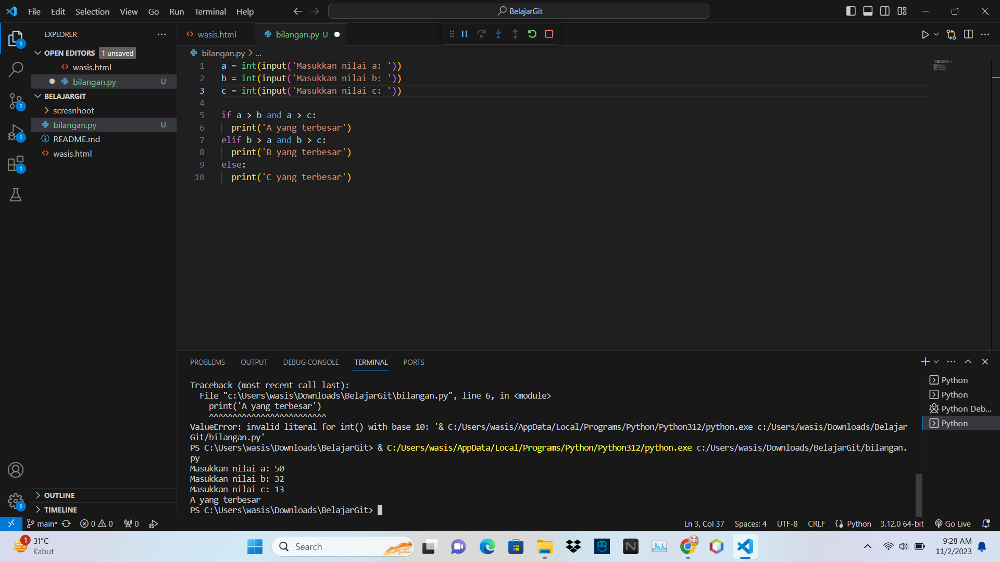

T.BAHASA PEMOGRAMAN

buat repository di git hub

echo "Praktikum 2" >> README.md

github comit -m "deskripsi file"

upload ss an di github

lalu salin link lalu kirimkan ke tugas PRAKTIKUM 2 B.pemograman

+ <h1></h1>

